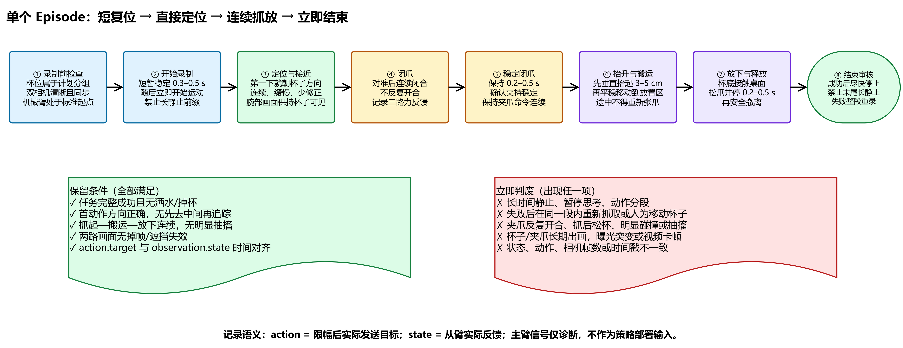
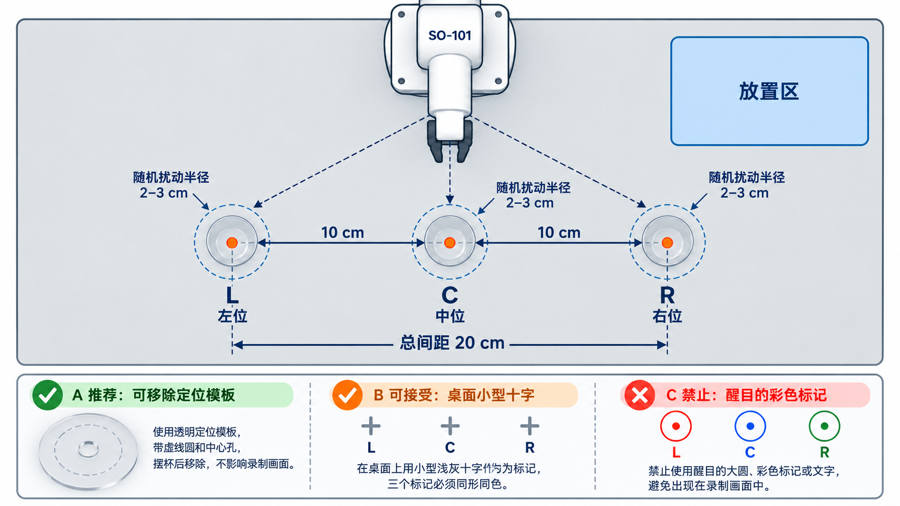

# 透明水杯 SO-101 数据集采集指南

> 适用任务：SO-101从装水透明杯的不同位置出发，完成定位、抓起、搬运、放下和释放。本文优先规定“一个episode怎样采”；数据集规模、train/dev/test划分和模型训练另行冻结。

## 1. 核心目标

一个episode必须是一条完整、连续、成功的因果链：

```text
短复位 → 直接朝杯子定位 → 接近 → 连续闭爪 → 稳定保持
       → 抬升 → 平稳搬运 → 放下 → 连续释放 → 撤离 → 立即结束
```

本项目已经验证，长静止前缀、近似相同观测对应不同动作位置、只保存主臂动作而不是实际发送目标，会导致模型在真机起步时自锁、动作被平均或产生固定偏置。因此，采集时首先保证时序语义正确，其次才追求episode数量。



可编辑源文件：[透明水杯_单episode采集时间轴.drawio](assets/透明水杯_单episode采集时间轴.drawio)

### 1.1 左、中、右三点位

第一版正式数据只改变杯子的横向位置：左位、中位、右位处在同一条水平线上。以中位为基准，左、右中心各偏移`10 cm`，左右总跨度`20 cm`；每个中心允许在半径`2–3 cm`范围内随机扰动。该数值是首轮建议，正式打印定位模板前必须用新机械臂低速确认三点均安全可达、腕部画面不丢杯且不会触碰桌面边界。



点位需要给操作者提供定位参考，但最好不要把醒目标记留在录制画面中：

- **推荐**：使用可移除的透明/纸质定位模板，摆杯后移走再开始录制。
- **可接受**：三个点位始终保留同形同色的小型浅灰十字，且训练和部署场景完全一致。
- **禁止**：红、蓝、绿大圆，或直接写醒目的`L/C/R`；这会诱导模型依赖标记而不是杯子视觉。

## 2. 冻结的采集接口

### 2.1 相机

- `observation.images.top`：固定俯视工作区，现有top相机可以继续使用。
- `observation.images.gripper`：腕部相机，建议90°–100°视场，焦点固定在约10–25 cm工作距离。
- 两路统一保存为`640×480 @ 30 FPS`；如果硬件输出1280×720，必须在整套数据中使用同一种裁剪/缩放规则。
- 固定安装位置、方向、焦点、曝光、白平衡和增益；数据集采集中途不得悄悄更换。
- 使用稳定的`/dev/v4l/by-id/...`设备路径，不依赖可能随重启变化的`/dev/videoN`。

### 2.2 状态、动作与力反馈

每帧至少保存：

- `observation.state`：从臂各关节及夹爪的实际位置反馈。
- `action`：经过关节映射、限幅和安全处理后，实际发送给从臂的目标；不能直接用未经处理的主臂原始位置冒充。
- 夹爪实际`pos/load/current`，最好同时保留电压、温度和硬件错误码，供力控标定与异常排查。
- 每路相机帧时间戳、状态读取时间戳、动作发送时间戳。

主臂信号可以另存为诊断或操作者意图，但不得混入最终策略的`observation.state`。部署时不存在的字段，例如`master_gripper.pos`，不能作为训练输入。

### 2.3 任务与环境

- 始终使用规定水量的透明杯；每轮开始前记录水位范围。
- 桌面、背景、光照和放置区保持一致；计划做泛化时再有控制地分组变化。
- 杯位按预先定义的左、中、右及前后区间采样，分组数量尽量平衡；不要由操作者连续采一串相邻位置。
- 当前三点位版本不改变前后深度：L/C/R中心间距依次为10 cm，总跨度20 cm；三组episode数量相同，组内使用半径2–3 cm随机扰动。
- 训练、验证和测试按episode分开，不能把同一episode的不同帧拆入不同集合。

## 3. 录制前检查

每个episode开始前完成以下检查：

1. 杯子位于本episode计划的杯位，水量正确，桌面无多余物体或水迹。
2. 从臂处于标准起始姿态；用程序复位或严格标定姿态，不依赖“大概摆回去”。
3. top画面覆盖整个工作区；腕部画面能在接近时同时看到杯子和两侧夹爪。
4. 杯子、水面和夹爪清晰，两路相机实测约30 FPS，无曝光跳变。
5. 主从臂遥操作连续，无关节反向、卡顿、异响或线缆牵拉。
6. 夹爪能够稳定夹住装水杯；安全区域、急停和吸水材料已准备。

任一项失败，不开始录制。

## 4. 单个episode的标准动作

### 4.1 开始录制：短暂稳定后立即动作

- 启动录制后只保留约`0.3–0.5 s`（9–15帧）稳定起点，用于建立状态基线。
- 随后立即开始向杯子运动；不要录入数秒等待、思考或反复调整主臂的静止前缀。
- 第一个明显动作必须已经与杯子实际方向一致。杯子在左侧就向左启动，不能先朝工作区中间运动再追踪。

### 4.2 定位与接近

- 采用一条连续、自然的轨迹接近杯子，速度宁可略慢，但不能“动一下、停一下、再修一下”。
- 大幅修正应在远离杯子时完成；接近杯体后只做小幅连续修正。
- 夹爪保持张开，抓取中心对准可稳定夹持的位置，不必追求透明杯壁的像素级边界。
- top相机负责全局杯位，腕部相机负责近距离夹爪—杯子相对关系。

### 4.3 闭爪

- 对准后连续闭合，不要反复开合试探。
- 闭爪不是单独一帧，而是一个从“开始闭合”到“闭合基本稳定”的动作区间。
- 闭合速度应能让杯子稳定受力，避免突然夹紧导致杯体滑动或水面大幅晃动。
- 如果抓偏、碰倒、杯子明显滑移或需要二次抓取，立即停止并将整个episode判废。

### 4.4 稳定闭爪窗口

- 闭合基本稳定后保持`0.2–0.5 s`（6–15帧），然后开始抬升。
- 保持期间夹爪命令应连续，不能在“保持”和“抬升”之间重新张开。
- 该窗口用于学习“闭爪完成后再抬升”的顺序，也为`pos/load/current`建立接触基线。

### 4.5 抬升与搬运

- 先近似垂直抬起`3–5 cm`，确认杯子脱离桌面后再向放置区移动。
- 抬升、平移和下降应连贯平滑；避免突然加速、急停、来回修正和明显关节抖动。
- 搬运过程中持续保持闭爪，不要因为主臂手指松动而让从臂重新张开。
- 若杯子滑落、倾斜失控、明显洒水或出现碰撞，整段判废。

### 4.6 放下与释放

- 杯底稳定接触桌面后再开始释放；不要在悬空时提前松爪。
- 连续松开夹爪，保持`0.2–0.5 s`确认杯子稳定，再平滑撤离。
- 释放同样是一个动作区间，不要求人工挑出唯一“松爪帧”。

### 4.7 结束录制

- 任务成功并安全撤离后，在`0.3–0.5 s`内停止录制。
- 不需要等待机械臂长时间保持静止，也不必在同一episode内返回初始姿态。
- 返回初始姿态放在episode之间完成，不属于当前episode的任务动作。

## 5. episode保留与判废

只有以下条件全部满足才保留：

- 完整完成抓起、搬运、放下和释放；杯子最终稳定且没有洒水。
- 首个明显动作与杯位方向一致，没有先朝中间走再慢慢追杯。
- 接近、闭爪、抬升、搬运、放下、释放连续，没有明显抽搐或长暂停。
- 抓起后没有重新张爪，放下前没有提前释放。
- top和腕部视频完整、清晰、无掉帧，杯子和夹爪在关键阶段可观察。
- 动作、状态、力反馈和两路视频帧数/时间戳一致。

出现以下任一情况，整个episode判废并重新采集，禁止在同一episode里“修回来”：

- 抓偏后进行第二次抓取；
- 操作者或其他人移动杯子；
- 长时间静止、暂停思考或动作被切成多段；
- 夹爪反复开合、抓后松杯；
- 碰撞、掉杯、洒水或超出安全范围；
- 关键目标长期出画、严重模糊、曝光突变或视频卡顿；
- 状态/动作维度变化，或者时间同步失败。

判废片段可以单独保留在故障归档中用于分析，但不得混入成功示教训练集。

## 6. 每段采完立即审核

采完后不依赖记忆，立刻查看视频和数据，记录以下边界：

1. `close_start`：夹爪开始持续闭合。
2. `close_end`：闭合基本稳定。
3. `lift_start`：杯子开始持续离开桌面。
4. `release_start`：夹爪开始持续松开。
5. `release_end`：释放基本完成。

同时记录：杯位分组、是否成功、是否洒水/掉杯、是否二次抓取、是否有明显抽搐、异常备注。遮挡像素是未知而不是背景；插值框或SAM传播结果不能冒充人工真值。

## 7. 首批pilot采集与数据Gate

新机械臂、新相机或新代码第一次投入时，先采10个pilot episode，不直接开始正式60集：

1. 逐episode核对双相机、state、action和`pos/load/current`帧数一致。
2. 验证`action`确实等于限幅后实际发送目标，而非主臂原始命令。
3. 测量相机→状态→动作的时间差，排查类似既往约4帧响应延迟。
4. 检查各关节命令是否存在持续不可达或饱和。
5. 可视化前15帧，确认没有长静止前缀且首动作方向正确。
6. 审核闭爪稳定窗口、抬升和释放边界，确认语义能稳定判断。

pilot全部通过后，才冻结相机参数、schema、控制频率和操作规范，开始正式采集。若更换相机安装位置、关节映射或动作后处理，应重新执行pilot Gate。

## 8. 正式数据集的最低记录清单

每个episode至少记录：

- episode ID、操作者、时间、机械臂校准版本；
- 杯位分组、杯中水量、任务文本；
- top/gripper相机型号、设备路径、分辨率、FPS及参数版本；
- `observation.state`字段名称、顺序、单位；
- `action.target`字段名称、顺序、单位及限幅版本；
- 夹爪`pos/load/current`及时间戳；
- 五个动作边界和episode级成功/失败原因；
- 数据采集代码commit、配置文件和异常日志。

## 9. 现场速查版

```text
开始前：杯位正确｜双相机清晰｜标准起点｜遥操作正常
开始后：静止≤0.5s｜第一下直接朝杯子｜连续接近
抓取：一次对准｜连续闭爪｜稳定0.2–0.5s｜再抬升
搬运：先垂直抬3–5cm｜保持闭爪｜平滑移动
放下：接触桌面后松爪｜稳定0.2–0.5s｜撤离
结束：成功后≤0.5s停止｜失败整段丢弃，不在段内补救
```
